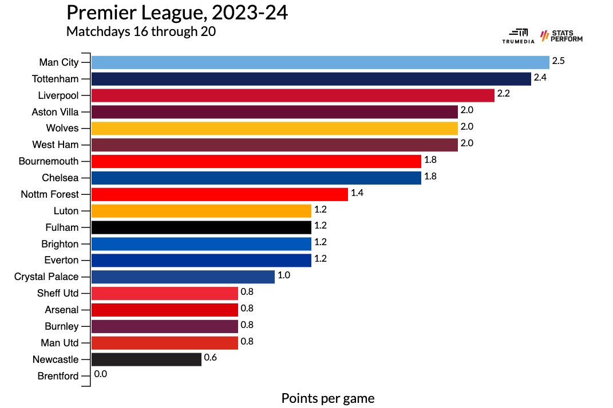

```{r setup, include = FALSE}
##   when the tidyverse library is loaded, messages are generated that we do not want to include in the knitted document
## setting the chunk argument include = FALSE means this chunk is executed, but the text in the chunk and any output do not appear in the knitted document

## The following command sets some options for this R Markdown file
  ##   echo = TRUE means that the code in R chunks will appear in the knitted document
  ##   message = FALSE and warning = FALSE mean that messages and warnings do not appear in the final document
  ##   error = TRUE means the document will continue to knit in the presence of errors while knitting
  ##   fig.height = 3 means figures are 3 inches tall unless otherwise specified
knitr::opts_chunk$set(echo = TRUE, message = FALSE, warning = FALSE,
                      error = TRUE, fig.height = 3, fig.width = 4)

library(tidyverse)
```

# Overview

## Learning Outcomes

* These lectures will teach you how to:
  - Create basic graphs with ggplot2
  - Choose an appropriate graph based on the variable/question of interest
  - Visualize data among subgroups, whether on the same panel or across multiple
  - Manipulate specific elements of graphs with ggplot2
  

## Preliminaries

1. Download the file `week03-ggplot2.Rmd` into the `week03-ggplot2` sub-folder.
2. Download the file `lake-mendota-winters-2023.csv` into the `COURSE/data/` folder.

## Lake Mendota Dataset

- Scientists have been recording the dates when Lake Mendota first closes due to ice (at least half the surface is covered with ice) and opens (more than half the surface is liquid water) since the middle of the 1800s.

* This data set contains **one row for every winter season**, which starts in the late months of one year and ends in the early months of the next.
    + The first winter recorded is 1855-56, and the most recent winter recorded is 2022-23.
    + The variable `year1` is the first year of the given winter season.
    + The variable `duration` is the total number of days that Lake Mendota was closed in that winter.

### Read The Data

- The following R chunk has one line of code that will take the data in the .csv file and read it into a variable named `mendota`.

```{r read-data, message = TRUE}
## This assumes that:
### STAT240/data/ contains the data file
### STAT240/lecture/week03-ggplot2/ is your working directory.
### If this gives you "Error: could not find file ... in working directory ...", go to Session > Set Working Directory > To Source File Location, and try again.
### If that doesn't work, then you downloaded one or both files to the wrong place, or they have the wrong name - make sure they don't have a " (1)" or "-1" at the end of their names, which can happen when you download multiple times.

mendota = read_csv("../../data/lake-mendota-winters-2023.csv")
```

### Exploring the Data

* `read_csv()` produces some colorful output; but just like there is intimidating output when running `library(tidyverse)`, a lot of colorful output usually means the command worked.

- The output from `read_csv()` summarizes some important characteristics of the dataset, including:
    - specifies the number of rows and columns in the data set
    - the names and types of the columns (though this may get cut off if your dataset has many or long column names)

* `read_csv` tries to intelligently guess the type you want each variable to be.
    + We can also see the type of each column with `glimpse(mendota)`.
    
```{r}
glimpse(mendota)
```

- `<chr>` stands for "character"; the values in `winter` are character strings.
- `<dbl>` stands for "double"; this is the technical term for a numeric column. All columns except `winter`, `first_freeze`, and `last_thaw` are numeric.
- `<date>` represents dates which are specific to the level of day. Notice how `year1` is not read in as a date, because R does not know to distinguish between, for example, 1855 the year and 1,855 the number. However, `first_freeze` and `last_thaw` specify a day within a year, so they are read in as dates.
    + For this data set, the guesses are all correct and no changes are required.
    + `read_csv`, with the underscore, is the tidyverse version of base R's `read.csv` (with a dot). The tidyverse version makes more intelligent guesses on column types, and produces a `tibble` rather than a `data.frame`. For this reason, we always recommend and will write `read_csv` instead of `read.csv`.

* `View(mendota)` will bring up the whole dataframe in a different window. You can also, alternatively, click on the name "mendota" in your Environment tab. Take a second to review an individual row and make sure you specifically understand the relationship between `winter` and `year1`, and the relationship between `first-freeze`, `last_thaw`, and `duration`.

# An Introduction to ggplot2

> The **tidyverse** package **ggplot2** is based on a *grammar of graphics* (what the gg in ggplot2 stands for).

* Having a "grammar" of graphics is important because:
    + A wide variety of graph types can be implemented with extremely similar code
    + The user has a rich language to customize plots to a more rich degree than graphing software with pre-specified dropdown menu options
    + **Just like ordinary language, the creative combination of smaller building blocks can support a very wide range of expression.**

## Principles of ggplot2

* You provide ggplot2 a **dataframe/tibble**.

* You provide ggplot2 a **mapping**; namely, which variables in your dataframe should control which properties of the marks on your plot?
    + For example: I want the variable `year1` to dictate the `x` position (horizontal) of marks, and I want `duration` to dictate the `y` position (vertical) of marks
    
* With this established, you build the plot with **layers**.
    + First, you put the blank canvas down.
    + With the second layer, you will usually add the marks (our general term for the shapes on the graph; lines, points, bars, boxplots, etc.) on top of that canvas which correspond to the data, according to the established mapping.
    + Sometimes, we will add additional layers on top of this, and often we will customize features of previous layers.

* If you stop there, ggplot2 is perfectly capable of making reasonable visual decisions, including but not limited to:
    + The size, shape, color, and transparency of marks
    + The position, appearance, and labeling of axes
    + The general shape and appearance of the plot
* However, all of these things (and so many more - in fact, an overwhelming amount more) can be **customized**.

## Creating a Basic Plot with ggplot2

* This section will take you through the entire real process of creating a basic graph with ggplot2.

---

##### EXERCISE: Planning Out Your Graph

* We will begin to use ggplot2 by attempting to visually answer the question:

> How has the duration of time Lake Mendota closes due to ice each winter changed over the last 168 years?

* Before we start throwing code around at this ambitiously broad question, let's form a plan of what we want our graph to look like.

* Toward this end, it can be useful to consider a much smaller subset of the full dataset; for example, the last six years.

```{r}
# The "opposite" of head(); gives the last (most recent, in this case) n rows, n defaults to 6.
mendota_small = tail(mendota)

mendota_small
```

* How would you describe the pattern of `duration` over the last six years?
    
* How would you represent that pattern graphically? Draw an informal sketch or think about the shape of the graph.

* Did your sketch look something like this?

```{r, echo = FALSE}
# It is natural to describe the pattern of duration as a "dip", or a "parabola". "Duration starts high, is low in the middle, and then ends high again."

# Notice the language you use here implies certain intuitive graphical properties. "high" and "low" refer to vertical heights, while "starts", "in the middle" and "end" refer to horizontal positions.

# You are not expected to understand this code at this point in the lecture, which is why we keep it from appearing in the knitted file
ggplot(mendota_small, aes(x = year1, y = duration)) +
  geom_line() +
  theme_void()
```

* This shape implies that `year1` is the x-variable, and `duration` is the y variable.

```{r, echo = FALSE}
# You are not expected to understand this code at this point in the lecture, which is why we keep it from appearing in the knitted file
ggplot(mendota_small, aes(x = year1, y = duration)) +
  geom_line() +
  
  # standing for "labels", we'll get to this in Deeper Customization
  labs(
    x = "Year",
    y = "Duration"
  ) +
  
  # increase size of axis title and labels, we'll get to this in Deeper Customization
  theme(
    axis.title = element_text(size = 25),
    axis.text = element_text(size = 15)
  )
```

> The trend in the data is made extremely obvious and intuitive by this graph. This is what a good graph accomplishes, and its effectiveness depends on the choices you make.

* Notice how the following shape graph is less intuitive at showing the pattern. It's still there, but requires more thought.

```{r, echo = FALSE}
# You are not expected to understand this code at this point in the lecture, which is why we keep it from appearing in the knitted file
ggplot(mendota_small, aes(x = duration, y = year1)) +
  # We won't teach this geom; it is like geom_line(), but connects points in the order they appear in the data, rather than left to right
  geom_path() +
  
  # standing for "labels", we'll get to this in Deeper Customization
  labs(
    y = "Year",
    x = "Duration"
  ) +
  
  # increase size of axis title and labels, we'll get to this in Customization
  theme(
    axis.title = element_text(size = 25),
    axis.text = element_text(size = 15)
  )
```

* Now let's actually learn some code; we'll create the first graph we decided on, but using the entire dataset!

---

### The First Layer

> Laying down the blank canvas is done with the function `ggplot()`.

```{r}
ggplot()
```

* Arguments to `ggplot()` are where we will tell the plot what it needs to know: the data, and the mapping, as described in Principles.
    + From the help page for the `ggplot` function (recall: run `?ggplot` in your console to bring it up), the first two arguments are named `data` and `mapping`.
    
    + `data` is simply the dataframe you want to graph; we will eventually use the full dataset; `mendota` from the earlier chunk, but I also use `mendota_small` (the last six rows only) for smaller examples.
    + `mapping` is a little more complicated. Rather than an object, you are going to give it a *function* which tells the plot what properties correspond with what variables.
    
* The `aes()` function, standing for "aesthetic", is what you need to pass in as the `mapping`.
    + Within `aes()`, you specify as many or as few pairs as you want, which connect graph properties to variables in your dataframe you entered as `data`. These pairs take the form `graphProperty = variableName`, with pairs separated by commas.
    + For our plot, we want `year1` to control the `x` position of the line, and `duration` to control the `y` position of the line.
    
```{r}
ggplot(data = mendota_small, mapping = aes(x = year1, y = duration)) 

# Sidenote: if you are a first-time coder, make sure you understand why this line ends with two parentheses! You can click your cursor to the RIGHT of a parentheses, and RStudio will highlight its match. Very useful when code gets more intense.

# The second of the two is the end of the much larger ggplot() function, which contains the data and mapping arguments. 
# The first of the two is the end of the aes() function, which contains the x and y named arguments.
```

* The basic framework for the plot now exists upon the canvas, even though we haven't put any marks on it yet; just like the instructions for the plot exist within the call to `ggplot`.

* Notice how ggplot2 has made intelligent decisions for how wide each axis should be, where the gridlines and labels are, et cetera.

### The Second Layer: Geom_ Functions

* Now, we need to add a layer *on top of* this canvas with a mark representing the data, which brings us to two important code concepts.

> Adding layers to a ggplot is accomplished by "adding" functions together with the `+` symbol. Each function creates a layer, and they will appear on the plot in the order you specify them in, back to front, like stacking plates.

* For example, in the chunk below, the `ggplot` call lays the canvas down, and then we will ADD the next layer on top, with some function to create the line.

```{r, eval = FALSE}
ggplot(data = mendota, mapping = aes(x = year1, y = duration) ) +
  some function to create the line...
```

* Notice the `+` is at the END of the first line, not the beginning of the second. Separating each function onto its own line is helpful visually, but not required.

> Adding a layer of marks to the canvas is done with the **geometry** functions, which take the form `geom_something`, where `something` is a descriptive name like `point` or `line`.

* There are dozens of `geom_` functions which indicate what type of mark you want to put on the plot, including but not limited to the list below. Many are intuitive, some are not.
    + `geom_line`
    + `geom_point`
    + `geom_text`
    + `geom_smooth`
    + `geom_boxplot`
    + `geom_histogram`
    + `geom_density`
    + `geom_bar`
    + `geom_col`
    + `geom_segment`
    + `geom_ribbon`
    + `geom_area`
    + `geom_violin`

* When other users create visualization packages, very often they will name their main visualization command `geom_something` and make it compatible with ggplot syntax.
    + For example, the [sf](https://ggplot2.tidyverse.org/reference/ggsf.html) package, standing for "spatial features", includes `geom_sf` to plot geographic maps.
    + The [ggimage](https://github.com/GuangchuangYu/ggimage) package includes `geom_image` to plot images on a graph.

* In our quest to recreate the line graph from the exercise above, we will eventually use `geom_line`.

* However, before working up to that, we'll start with (in my opinion) the easiest `geom` to understand: `geom_point`.

* `geom_point` requires TWO mappings: a numeric `x` and a numeric `y`. It places a single point (by default, a small black circle) for each row in your dataset.
    + `geom_point` does not require any arguments here, since we have already told the plot what dataframe we are using, and which variables represent `x` and `y`, within the first-line call to `ggplot`!

* It is instructive to look at the dataframe and connect each row with the point which represents it.

```{r}
# This code displays all rows (blank before comma) for the second and fourth column of the dataframe mendota_small.
mendota_small[ , c(2, 4)]

ggplot(data = mendota_small, mapping = aes(x = year1, y = duration) ) +
  geom_point()
```

* Now, let's return to `geom_line`, which connects these points with a line (by default, a thin, black, solid line).

```{r}
ggplot(data = mendota_small, mapping = aes(x = year1, y = duration) ) +
  geom_line()
```

* Finally, let's take the training wheels off and use the full dataset!

```{r}
# Replacing mendota_small with mendota
ggplot(data = mendota, mapping = aes(x = year1, y = duration) ) +
  geom_line()
```

* You just completed the fundamental visualization process! Congratulations!
  
* With two `geom`s at our disposal, we're now going to introduce some more complex concepts in ggplot2, before getting to the "Gallery of Geoms".

# More on Aesthetics and Layering

## Variable vs. Constant Aesthetics

* The `geom` functions also allow you to customize properties of their marks, such as size, color, shape, transparency, et cetera.

* You can give all of the marks the same property, or you can map it to a variable in your dataframe.

* For example, let's start with a **scatter plot** of the entire dataset.

```{r}
ggplot(data = mendota, mapping = aes(x = year1, y = duration) ) +
  geom_point()
```

* Say we wanted to make all of the points larger and red. Because we are setting ALL marks to have the same property, this is called a **constant aesthetic**. You can use the `size` property within `geom_point`.

* Just like the pairs in `aes()` which took the form `graphProperty = variableName`, these constant aesthetics take the form `graphProperty = constantValue`, where ALL marks will have `constantValue` for that `graphProperty`.

```{r}
ggplot(data = mendota, mapping = aes(x = year1, y = duration) ) +
  geom_point(size = 5, color = "red")

# Note that properties like size and color MUST be named; the geoms do not have an internal order for them.

# Practice changing size to different numbers! The default size is 2.
# Practice changing color to different colors! Run colors() in your console to get a list of all R supported colors. It also takes HEX codes.

# Notice that "red" is in quotes. We do this to indicate to R we literally mean the color red, rather than referring to some variable which happens to have the name red. It helpfully highlights that text red to indicate it understands you mean the literal color.
```

* `aes()` exists to map *graphical properties* to *variables*. We did not use it within `geom_point` above because 5 and "red" are not variables; they are constant values.

* What if we instead wanted to adjust some property of the points - say, their color - based on the value of a variable, which might differ from row to row (winter to winter)? This is called a **variable aesthetic**.

> Constant aesthetics, or mapping a graphical property to the same, constant value for all observations, are achieved in the `geom` function itself WITHOUT the use of `aes()`. Variable aesthetics, or mapping a graphical property to a variable in the dataframe, are achieved with `aes()`.

> ANY property of a graph can be mapped to a constant or a variable.

* We'll demonstrate this concept with the column `intervals`, which indicates for each winter season if Lake Mendota only had a single  uninterrupted closure (the value 1), or if it closed for some time, opened for some time, and then closed again (the value 2).
    + There are seven winters which fall into the second category; all others had a single uninterrupted closure.

* Let's try adding the map `color = intervals` within `aes()` to the original scatter plot.

```{r}
ggplot(mendota, aes(x = year1, y = duration, color = intervals) ) +
  geom_point()
```

* See if you can identify the seven winters which had two closures! They are all relatively recent!

* Notice that ggplot2 automatically chose a color scheme for us and created a legend.
    + If you specify a property other than `x` or `y` with a *variable* aesthetic, it will create a legend. 
    + If you specify a property other than `x` or `y` with a *constant* aesthetic like the earlier examples, no legend is necessary.
    + While ggplot's default choices have been acceptable so far, the legend type it has chosen is perhaps not ideal here.
    
* The reason the legend is a little misleading is R sees that `intervals` is a `numeric` column, so it wants to account for the possibility of `intervals` being 1.5, or 1.6, or any decimal value between the lowest and highest one it sees. 

* We would rather tell R that `intervals` can only take on two unique values; those values do happen to be numbers, but think of them as if they were distinct categories, like "A" and "B". 
* This kind of variable is called a `factor` variable in R; we may refer to it as a *categorical* variable.

    + We can remedy this by wrapping `intervals` in the function `as.factor()`.
    + `as.factor` is part of a family of '`as.*` commands, including `as.numeric()` and `as.character()`, which allows us to quickly switch a column to a different type.
    
```{r}
ggplot(mendota, aes(
    x = year1, 
    y = duration, 
    color = as.factor(intervals)
    ) # this parentheses ends the aes() call
  ) + # this parentheses ends the ggplot() call
  geom_point()
```

* Now R understands `intervals` can only take two values... the legend is better, and the colors diverge more.    
    
* Finally, we can and often do use both variable aesthetics and constant aesthetics in the same plot.
    + All points below are set to size 5; a *constant* aesthetic.
    + They are colored by their value of `intervals`, a *variable* aesthetic.

```{r}
ggplot(mendota, aes(x = year1, y = duration, color = as.factor(intervals))) + 
  geom_point(size = 5)
```

---

##### EXERCISE: Layering and Local Constant Aesthetics

* This exercise will reinforce the concept of layering and give you practice setting constant aesthetics.

* Recall that additional layers are added to a ggplot with `+`. Consider adding a `geom_line` to the basic scatter plot, like so:

```{r}
ggplot(mendota, aes(x = year1, y = duration)) + 
  geom_point() +
  geom_line()
```

* Are the points on top of the line, or is the line on top of the points? It is impossible to tell right now because they are both small and the same color right now.

* Change the local `size` and `color` aesthetics of the line and the points to make it visually clear which layer is on top.

```{r}
# Try on your own: Adjust aesthetics of geom_point and geom_line
ggplot(mendota, aes(x = year1, y = duration)) + 
  geom_point(size = 5, col = "blue") +
  geom_line(col = "red")
  
```

> Technical takeaway: Layers are placed "back" to "front" ("bottom" to "top") as you add them on.  

> Philosophical takeaway: You almost certainly did not get the best size/color combination on your first try. Creating a ggplot is an **iterative process**, where you try something, observe the output, adjust accordingly and try again; repeating until you are happy with the output.

---

## Variable Aesthetics: Global vs. Local

* In the last exercise, you set *constant* aesthetics within each of `geom_point` and `geom_line`. The aesthetics you set within `geom_point` did NOT affect the appearance of the `geom_line`, and vice versa.

* However, consider the following example, where the *variable* aesthetic `color = intervals` is added in the original `ggplot` call:

```{r, fig.height = 4, fig.width = 5}
ggplot(mendota, aes(x = year1, y = duration, color = intervals) ) +
  geom_line(size = 2) +
  geom_point(size = 4)
  
```

* Notice that `geom_point` and `geom_line` BOTH obey this aesthetic! What if we just wanted the points to change color with the value of `intervals`, but not the line?

> Variable aesthetics set in the first call to `ggplot` are called **global** variable aesthetics, and will apply to all future `geom`s. You can also set **local** variable aesthetics, with the mapping argument in an individual `geom` function.

* In the plot above, `geom_point` and `geom_line` have no arguments. But they know what dataframe to use, what their `x` and `y` position should be, and what color they should be because we specified them *globally* in `ggplot`. 
    + More technically, they inherit the `data` and `mapping` of the original `ggplot` call.

* However, just like `ggplot`, each `geom` function has a `mapping` argument that you may specify with a call to `aes()`, which will set a variable aesthetic *locally*, i.e. just for that `geom`. 

* The example below specifies the variable aesthetic `color = intervals` in the `mapping` argument of `geom_point` specifically (instead of `ggplot`); notice how the line is no longer changing color.

```{r, fig.height = 4, fig.width = 5}

# This is our most complex graph code yet! Not an overwhelming amount of code, but there is a LOT to dissect here! 

# In addition to layering, all three types of aesthetic are present. We also have named and unnamed arguments to functions... look how far we've come!

# data = mendota, x = year1, and y = duration (global variable aesthetics) will apply to both geoms.
# size = 2 (local constant aesthetic) only applies to the line.
# color = intervals (local variable aesthetic) and size = 4 (local constant aesthetic) only apply to the points.

ggplot(mendota, aes(x = year1, y = duration) ) + 
  geom_line(size = 2) + 
  geom_point(mapping = aes(color = intervals), size = 4) 
  
```

---

##### EXERCISE: Why Won't It Work?

* You are trying to create the above graph, without the line. In particular:
    + `year1` should be on the x axis
    + `duration` should be on the y axis
    + The *points* should be colored by `intervals`.
    
* However, your four code attempts below are producing errors or incorrect graphs.

* Examine the code and the associated error message/output, and explain what is going wrong and why.

```{r, error = TRUE}
ggplot(mendota) +
  geom_point(aes(color = intervals))
```

```{r, error = TRUE}
ggplot(mendota, aes(x = year1, y = duration)) +
  geom_point(color = intervals)
```

```{r}
# Why are these points not huge? Why is there a legend for it?
ggplot(mendota, aes(x = year1, y = duration)) +
  geom_point(aes(color = intervals, size = 1000))
```


```{r, eval = FALSE}
# This just produces a gridded canvas with no points. Why?
ggplot(mendota, aes(x = year1, y = duration, color = intervals))
  geom_point()
```

> Technical takeaway: These are very common mistakes people make when learning ggplot. Also, Examining error messages is a very important skill; often times there is a helpful message somewhere in there, like the first one, but sometimes there isn't, like the second one.

> Philosophical takeaway: We don't have a unit called "reading error messages" because it is a skill acquired through practice. (And putting the error message into Google. Lots of that.)

> Philosophical takeaway 2: Coding can be a particularly frustrating thing to learn for the first time, because one wrong character can cause you to get a scary error message instead of a beautiful graph. This can make you feel further from the solution than you really are... persevere! Very often you are just one small change away from the answer!

---

# The Gallery of Geoms

* Now that we've established a groundwork vocabulary and framework for understanding where certain aesthetics go in code and which layers they apply to, we can begin to branch out into the large variety of `geom`s available to us!

* We'll also be taking detours to learn other miscellaneous helpful things along the way.

* A friendly reminder that `?function` brings up the help page for that function!

## geom_smooth

> `geom_smooth` overlays a smooth, possibly curved line through the center of the data. It helps to emphasize the general trend when the raw data is very erratic.

* To illustrate `geom_smooth`'s usefulness with an example, consider the basic scatter plot we have been analyzing throughout this lecture.

```{r}
ggplot(data = mendota, mapping = aes(x = year1, y = duration) ) +
  geom_point()
```

* If you really try, you can sort of see the downward trend from this graph. However, the overlaying of `geom_smooth` makes it extremely clear to the viewer.

```{r}
ggplot(data = mendota, mapping = aes(x = year1, y = duration) ) +
  geom_point() +
  geom_smooth()
```

* We will learn more about this in the final unit of the course, but the gray ribbon around the line represents a statistical concept called a confidence interval. To suppress it, set the local constant aesthetic `se = FALSE`.

```{r}
ggplot(data = mendota, mapping = aes(x = year1, y = duration) ) +
  geom_point() +
  geom_smooth(se = FALSE)
```

* Finally, if you would rather have the best *straight* line through the data (more on that in the last week of the course!) you can set `method = "lm"`.

```{r}
ggplot(data = mendota, mapping = aes(x = year1, y = duration) ) +
  geom_point() +
  geom_smooth(se = FALSE, method = "lm")
```

---

##### EXERCISE: What Does Alpha Do?

* In this exercise, we'll explore what the `alpha` aesthetic does, and reinforce concepts of constant + variable aesthetics.

* It is not clear from its name what `alpha` is controlling; let's figure it out by trying it out! 

* First, as a constant aesthetic, `alpha` takes a value in the range [0, 1]. Try out different values to figure out what property it controls.

```{r}
# Change the values of alpha and re-graph!
ggplot(mendota, aes(x = year1, y = duration)) +
  geom_point(alpha = 0, size = 3) +
  geom_line(alpha = 0, size = 3) +
  geom_smooth(alpha = 1)
```

* Now that you know what alpha controls, try to predict what will happen when we map it to a variable aesthetic.
    + Then, run the code and see if you were right!

```{r, eval = FALSE}
ggplot(mendota, aes(x = year1, y = duration, alpha = duration)) +
  geom_point(size = 5)
```


> Technical takeaway: Alpha controls the transparency of a mark. It can accept a constant value in [0,1] for least to most visible, and can accept a numeric variable as well.

> Philosophical takeaway: If you are unsure about what some part of code is doing... try taking it out, changing it, putting it somewhere else, or just generally messing with it! Hands-on is the best way to learn to code, that's why I include these exercises. Alternatively, if you find yourself asking "What happens if I do this..." the best way to find out is by doing it!

---


## One Variable Plots

* The plots we have covered so far - for example, the first plot in the exercise above, have been motivated by the question: "How does duration of closure change as year increases?"
    + The fact that this is a *relationship between two numeric variables* (`duration` and `year1`) is reflected in what aesthetics the `geom`s require.
    + `geom_point`, `geom_line`, and `geom_smooth` all require an `x` AND a `y`.

* However, despite duration being a part of that graph above, it is not very effective at answering more basic questions like "What is the most common duration of closure?" or "What is the average duration of closure?"
    + Notice how these questions only mention a *single* variable: `duration`.

> The following three `geom`s analyze the distribution of a single variable, and as such, they require **exactly one** of `x` or `y`. They will then compute some useful statistic to serve as the one you don't give.

### geom_histogram

> `geom_histogram` takes a single numeric variable, splits the range into equal-length intervals (which we refer to as "bins"), and plots the number of values which fall into each interval.

```{r}
ggplot(mendota, aes(x = duration)) + 
  geom_histogram()
```

* Each "column" represents a duration interval, with the y axis encoding how many of our 168 winters were closed for a duration within that interval.
    + Those y axis values were not in our dataset; they were automatically calculated by `geom_histogram`.

* Unlike points and lines, these bars have width, so there are two different colors we may specify: a border color, with the `color` aesthetic, and the inside color, with `fill`.

```{r}
ggplot(mendota, aes(x = duration)) + 
  geom_histogram(
    color = "steelblue4",
    fill = "skyblue1"
  )
```

#### Coding Binning Schemes

* ggplot has been rather unhelpful in the above plot. From the way the x-axis is labeled, we can't tell exactly how wide each bin is, let alone what the two endpoints are. 

* Referring to the `geom_histogram` help page, we have `binwidth` and `bins` to help us out! We also have `center` and `boundary`, though this is admittedly less clear from the help page. All of these arguments take in a single number.

    + `binwidth` is how wide you want each interval to be.
    + `bins` is how many bins you want to end up with. You cannot specify both `binwidth` and `bins`.
    + `center` allows you to declare you want a bin centered around a specific number.
    + `boundary` allows you to declare you want a certain boundary between two bins. You cannot specify both `center` and `boundary`.
    
* These properties in combination allow you to set any interval scheme you want; it will start at whatever point you specified and build out from there.

* For example, if I want bins from 70-75, 75-80, et cetera, I could use `binwidth = 5` and `boundary = 70`; or `center = 72.5`, or `boundary = 90`, these would all produce that scheme.

```{r}
ggplot(mendota, aes(x = duration)) + 
  geom_histogram(
    binwidth = 10,
    boundary = 100,
    color = "steelblue4",
    fill = "skyblue1"
  ) +
  
  # This is just labelling the x-axis to make it clearer where the bins are. Read more about it in Deeper Customization.
  scale_x_continuous(breaks = seq(30, 160, by = 10))
```

#### Choosing Binning Schemes

> Choosing a reasonable binning scheme is a subjective but very important part of creating a histogram.

* Your choice of bins will often be found iteratively. For example, you might start with some guess, and find that your scheme has too many bins.

```{r}
# You can sort of see the shape, but still getting a lot of sharp peaks and valleys
ggplot(mendota, aes(x = duration)) +
  geom_histogram(
    binwidth = 2,
    color = "steelblue4",
    fill = "skyblue1")
```

* Perhaps then you overcorrect and try too few bins:

```{r}
# The peak should be more gradual than it is presented here, the low and high outliers aren't emphasized as much, we've lost the nuances of the data
# These bins are each one month wide
ggplot(mendota, aes(x = duration)) +
  geom_histogram(
    binwidth = 31,
    color = "steelblue4",
    fill = "skyblue1")
```

* Finally, you settle on a scheme which is a happy medium.

```{r}
# These bins are each one week wide
ggplot(mendota, aes(x = duration)) +
  geom_histogram(
    binwidth = 7,
    color = "steelblue4",
    fill = "skyblue1")
```

### geom_density

> `geom_density` takes a single numeric variable and produces a smooth curve representing its distribution.

```{r}
ggplot(mendota, aes(duration)) +
  geom_density(
    # Notice the same border-inside coloring scheme with color vs. fill
    color = "red4",
    fill = "red", # Default is totally clear, no fill color
    size = 2
  )
```

* The y-axis represents roughly the proportion of values near that point.
    + If you are familiar with integration from calculus; integrating the density curve from $a$ to $b$ will give you a value between 0 and 1 which is roughly the proportion of values which are between $a$ and $b$.

* Much like `geom_smooth` emphasizes the general trend while `geom_point` plots the raw data, `geom_density` emphasizes the general trend while `geom_histogram` plots the raw data.

```{r}
ggplot(mendota, aes(duration)) +
  geom_histogram(
    aes(y = after_stat(density)), # This line shrinks the histogram's height to be on the same scale as geom_density; out of scope of this course, no need to worry about it
    color = "steelblue4",
    fill = "skyblue1"
  ) +
  geom_density(
    color = "red4",
    fill = "red1",
    alpha = 0.3, # Transparency... the density plot is "on top"
    size = 2
  )
```

### geom_boxplot

> `geom_boxplot` takes a single numeric variable and creates a boxplot - a 1-dimensional representation of important statistics.

* A boxplot is fundamentally different from the other two single-variable `geom`s. It draws five lines, and colors a box behind the middle three, and plots very little of the actual data. Those lines are at:
    + The minimum (if not an outlier)
    + The first quartile (the 25th percentile)
    + The median (the middle value/50th percentile)
    + The third quartile (the 75th percentile)
    + The maximum (if not an outlier)

* Reminder: The Xth percentile is the value at which X% of the data is below it.

* Boxplots will not include outliers in the main plot, instead plotting them as their own dots.

```{r}
ggplot(mendota, aes(x = duration)) +
  geom_boxplot()
```

* Notice how the y axis has no label; that is because it does not represent anything, unlike the other two geoms.

* Interpretation of this plot:
    + The dots on the left are low outliers.
        - Outliers are identified as anything further than 1.5 "box widths" from the box on either side. The box width is technically called the "interquartile range", or IQR.
    + The left end of the thin line is the lowest non-outlier point.
    + The left end of the box is the first quartile, the 25th percentile.
    + The thick black line in the middle is the median, the 50th percentile.
    + The right end of the box is the third quartile, the 75th percentile.
    + The right end of the thin line is the highest non-outlier point.
    + The dots on the right are high outliers.

---

##### EXERCISE: Multiples of One Variable Plots

* This exercise will introduce the idea of comparing the distribution of a single variable across groups by replicating the plot within each group. To do this, it will introduce the `group`, `color`, `fill` variable aesthetics as powerful subgroup plotting tools. 

* For this exercise, we'll need to create a `century` column, which is either "19" for the 1800's, "20" for the 1900's, or "21" for the 2000's. (We'll also continue to use this variable through the rest of the file.)

```{r}
# You'll learn more about this code next week!
mendota = mendota %>% 
  mutate(century = as.character(floor(year1/100)+1),
         century = case_when(
           century == "19" ~ "19th",
           century == "20" ~ "20th",
           century == "21" ~ "21st"
         ))
```

* Run this code to generate three basic single-variable plots for `duration`.

```{r}
ggplot(mendota, aes(x = duration, fill = century)) +
  geom_histogram()
```

```{r}
ggplot(mendota, aes(x= duration, fill = century)) +
  geom_density(alpha = 0.5)
```

```{r}
ggplot(mendota, aes(x = duration, fill = century)) +
  geom_boxplot()
```

* Now, to each of these plots, add the variable aesthetic `fill = century`. Observe the similarities and differences in the way the three plots change.
    + What do you think would have happened if we had instead specified `color = century` and not `fill`? Try it out!

* Make a change to the density plot (with `fill = century` applied) to make it easier to see all three plots, even when they are overlapping. (*Hint: consider the previous exercise!*)

> Technical takeaway: Using a categorical variable for color or fill will generate three subplots on the same panel.

> Philosophical takeaway: There are pros and cons to each of these three subgrouped single-variable plots. Histograms show you the proportion of each subgroup within each interval, density plots keep the scale constant across the groups even if they are not equal size, and boxplots make it easy to compare quartiles and medians. It is up to you as the data scientist to determine what your viewer cares about.

---

## Bar Graphs

> There are two functions to create bar graphs; `geom_bar` is a shortcut to plot occurrences of a single categorical variable, and `geom_col` is a more general two-variable bar graph function.

### geom_bar

> `geom_bar` takes in a single categorical variable and plots the number of occurrences of each category. 

* Notice this definition is very similar to `geom_histogram`. The difference is that `geom_histogram` takes a *numeric* variable and counts the number of occurrences in custom bins, while `geom_bar` takes a *categorical* variable and counts the number of occurrences of each already existing category.

```{r}
ggplot(mendota, aes(century)) +
  geom_bar(
    color = "steelblue4",
    fill = "skyblue1"
  )
```

* Interpretation of this plot: Our dataframe has 45 observations from the 19th century, 100 observations from the 20th century, and 23 observations from the 21st century.
    + Those numbers were not directly in our dataframe, it counted them for us. 

* Unlike `geom_histogram`, `geom_bar` puts spaces between its columns to indicate that these are distinct categories, NOT a continuous numeric variable being split up into bins.
    + By default, the categories are ordered alphabetically, which happened to be what we wanted here.

### geom_col

> `geom_col` takes in one categorical variable and one numeric variable, and creates one bar for each row in the dataframe, with the heights specified by that numeric variable.

* With `geom_col`, you provide the heights of the bars. This can be both a strength and a weakness.
    + `geom_col` allows you to plot more than just number of occurrences; like we'll see below, it can be helpful to put something other than a count on the other axis.
    + If you do want to plot number of occurrences, `geom_col` requires you to do the calculation of the heights, while `geom_bar` does not.
    
* The below code takes our 168 winters in `mendota` and reduces it to three rows, one for each century that we want to plot. You'll learn more about this code next week.

```{r}
mendota_summarized = mendota %>% 
  group_by(century) %>% 
  summarize(numYears = n(), avgDuration = mean(duration))
  
mendota_summarized
```

* Notice how this data is different from the data we passed into `geom_bar`. The data above, for `geom_col`, has one row per visual bar. The data below, for `geom_bar`, has way more rows in the dataset than we will eventually have bars on the graph.

```{r}
mendota %>% 
  select(winter, century) %>% head()
```

* Using the `mendota_summarized` dataframe above, we can specify the "custom" heights of bars to be the number of years in each century, which we calculated. By doing this, we have recreated exactly what `geom_bar`.

```{r}
ggplot(mendota_summarized, aes(century, numYears)) +
  geom_col(
    color = "steelblue4",
    fill = "skyblue1"
  )
```

* However, `geom_col`'s advantage is to be able to make bar graphs of more than just counts. For example, we calculated the average `duration` within each century above, and can set those to be the heights of the bars.

```{r}
ggplot(mendota_summarized, aes(century, avgDuration)) +
  geom_col(
    color = "steelblue4",
    fill = "skyblue1"
  )
```

---

##### EXERCISE: More Than One Right Answer

* Earlier in this lecture, we reflected on the question: "How has the duration of closure of Lake Mendota each winter changed over time?'

* The above bar graph, at the end of the `geom_col` section, is one possible way to answer this question. We also used a scatter plot with `geom_smooth()` earlier, which I will remind you of here:

```{r}
ggplot(mendota, aes(year1, duration)) +
  geom_point() +
  geom_smooth(se = F)
```

* **Reflect on at least one thing the scatter plot illustrates better than the bar graph, and one thing the bar graph shows better than the scatter plot**.  

> Philosophical takeaway: Two very different graphs can answer the same question, and it is subjective which one is the "better" answer.

---

## Annotating With Lines

* A common graphical task is to annotate a horizontal or vertical line at some useful or interesting point on a graph to draw attention to it.

* `geom_vline` creates a vertical line, and one required aesthetic: `xintercept`, which controls the horizontal position of the line.
* `geom_hline` creates a horizontal line, and one required aesthetic: `yintercept`, which controls the vertical position of the line.

* Both additionally accept useful constant aesthetics like `size`, `color`, and `linetype` ("solid" by default, "dashed", "dotted", and more, see `?linetype`).

* Here's an example of annotating where the mean is on top of a histogram; you have to calculate the value yourself.

```{r}
meanDuration = mean(mendota$duration)

ggplot(mendota, aes(duration)) +
  geom_histogram(
    color = "steelblue4",
    fill = "skyblue1"
  ) +
  geom_vline(xintercept = meanDuration,
             size = 2) 

# Note: even though xintercept = meanDuration technically has a variable in it, that variable just contains one single number. It is not a column in the dataframe mendota. Therefore, this is a constant aesthetic and does not require aes().

# A reminder: geom_vline() should come AFTER geom_histogram! What would happen if we put geom_vline() before the geom_histogram?
```

* You can also give a vector of values as the `xintercept`. 

```{r}
usefulValues = meanDuration + c(-3, -2, -1, 1, 2, 3) * sd(mendota$duration)
# A vector with length six; these values are meaningful statistically, we'll learn why in the second half of the course
usefulValues

ggplot(mendota, aes(duration)) +
  geom_histogram(
    color = "steelblue4",
    fill = "skyblue1"
  ) +
  geom_vline(xintercept = usefulValues,
             size = 2) 
```

* And finally, an example of `geom_hline`.  Remember those outliers that `geom_boxplot` identified? We can identify them here!

```{r}
iqr = IQR(mendota$duration)
firstQuartile = quantile(mendota$duration, 0.25)
thirdQuartile = quantile(mendota$duration, 0.75)

ggplot(mendota, aes(x = year1, y = duration)) +
  geom_point() +
  geom_hline(
    yintercept = c(firstQuartile - iqr, thirdQuartile + iqr)
    )

```

# Deeper Customization

* We have mentioned many times and shown a few examples of `ggplot2` allowing very granular customization of plots; this section will take you through a few of the many ways you can customize `ggplot`s.

* While we will continue to add these customizations with `+`, the addition of these functions primarily serves to edit previously created layers. 

## Scales

> Editing graphical properties of the axes is done with the family of `scale_x_*` and `scale_y_*` commands.

* The asterisk specifies the type of variable on that axis. For example, `continuous` for variables like `duration` (which can take on any numeric value in a given range), or `discrete` for variables like `century` (which only take on one of a finite set of categories).

* We will most commonly use:
    + `scale_x_continuous()`
    + `scale_y_continuous()`
    + `scale_x_discrete()`
    + `scale_y_discrete()`

* Just like `geom`s, there are too many examples of `scale` functions to go over in one lecture; we will see many over the course of the class.

* Helpful arguments you can pass into `scale` functions include:
    + `breaks`, a vector of locations to draw grid lines and labels at.
    + `labels`, a vector of names to use as the label of each break-point. 
    + `limits`, a vector of two numbers specifying the left and right limit of how wide/tall you want the plot to be
    + `trans`, standing for "transformation", which allows you to do some numeric transformation of the axis; including "reverse", "sqrt", and "log".

```{r}
# Notice ggplot's default x-axis choices
ggplot(mendota, aes(duration)) +
  geom_histogram(
    color = "steelblue4",
    fill = "skyblue1"
  )
```

```{r}
ggplot(mendota, aes(duration)) +
  geom_histogram(
    color = "steelblue4",
    fill = "skyblue1"
  ) +
  scale_x_continuous(
    breaks = c(30, 90, 150),
    labels = c("1 month", "3 months", "5 months"),
    limits = c(15, 165),
    minor_breaks = NULL, # This specifies not to draw any vertical axis lines between the labeled points; not necessarily something you have to memorize, just an example of how far you can customize!
  )
```

```{r}
ggplot(mendota, aes(duration)) +
  geom_histogram(
    color = "steelblue4",
    fill = "skyblue1"
  ) +
  scale_x_continuous(
    breaks = c(30, 90, 150),
    labels = c("1 month", "3 months", "5 months"),
    limits = c(-100, 300),
    minor_breaks = NULL
  ) +
  # Can you figure out what this addition is doing to the y-axis?
  scale_y_continuous(
    expand = expansion(mult = c(0,0.1)),
    limits = c(-10, 100)
  )
```

### Color Scales

> When color is mapped to a variable aesthetic, you can use the `viridis` color scales for accessible preset options, or use the `manual` functions to set a custom color scale. 

* Recall the following plot from a previous exercise:

```{r}
ggplot(mendota, aes(x= duration, fill = century)) +
  geom_density(alpha = 0.3)
```

* `ggplot`'s default color schemes can be hard to distinguish for people with common forms of color blindness.
    + The "viridis" color scales are designed to remedy this.
    + Depending on whether your variable is continuous (`c`) or discrete (`d`), and whether you used `color` or `fill` as the aesthetic, you can use one of the following four commands:
        - `scale_color_viridis_c()`
        - `scale_color_viridis_d()`
        - `scale_fill_viridis_c()`
        - `scale_fill_viridis_d()`

* For example, in the plot above, we use `fill` as the aesthetic controlling color, with `century` a discrete/categorical variable, so we use `scale_fill_viridis_d()`.

* See two examples below; there are many options within viridis, see [here (scroll a little down)](https://cran.r-project.org/web/packages/viridis/vignettes/intro-to-viridis.html) for more details.

```{r}
ggplot(mendota, aes(x= duration, fill = century)) +
  geom_density(alpha = 0.3) +
  scale_fill_viridis_d()
```

```{r}
ggplot(mendota, aes(x= duration, fill = century)) +
  geom_density(alpha = 0.3) +
  scale_fill_viridis_d(option = "inferno")
```

* Alternatively, you might have a custom color scheme in mind. `scale_color_manual` and `scale_fill_manual` exist to help you; the `values` argument accept a vector of pairs, where you map values of the categorical variable to colors.

```{r}
ggplot(mendota, aes(x= duration, fill = century)) +
  geom_density(alpha = 0.3) +
  scale_fill_manual(
    values = c("19th" = "dodgerblue", "20th" = "peachpuff", "21st" = "mediumorchid")
    )
```

## Plot Labels

> All plot labeling can be done with the `labs()` (standing for labels) function.

* `labs()` can be used to add a title, subtitle, and caption; see placement examples below.

* It can also be used to adjust the axes labels and legend titles.
    + The legend title is controlled in `labs()` by whatever aesthetic you used to create the legend.
    + For example, in this plot we create the legend with `fill = century`, so the legend title is adjusted with `fill = "legend title"`.

```{r}
densityPlot = ggplot(mendota, aes(x= duration, fill = century)) +
  labs(
    title = "Distribution of Freeze Duration by Century",
    subtitle = "Lake Mendota, 1855-2023",
    caption = "STAT 240",
    
    x = "Duration (in days)",
    y = "Density",
    fill = "Century" # If you created your legend with the size aesthetic, this would be size = "legend title", or color would be color = "legend title", et cetera
  ) +
  geom_density(alpha = 0.3) +
  scale_fill_manual(
    values = c("19th" = "dodgerblue", "20th" = "peachpuff", "21st" = "mediumorchid")
    )

densityPlot
```

## Themes

> `ggplot2` comes with many built-in themes to improve the appearance of the graph over the default theme, such as `theme_minimal()`.

```{r}
densityPlot +
  theme_minimal()
```

```{r}
densityPlot +
  theme_classic()
```


* The [tidyverse list of complete themes](https://ggplot2.tidyverse.org/reference/ggtheme.html) are part of the tidyverse online reference.
    + You can also type `?theme_gray` or any other theme in your console.

---

##### EXERCISE: Dissect a Real Visualization

* Consider the following graph which appeared in a recent [ESPN article](https://www.espn.com/soccer/insider/insider/story/_/id/39241757/explaining-arsenal-losses-investigation-stats-analysis).



* Consider this partial dataframe below:

```{r}
teams = c("Wolves", "Aston Villa", "Liverpool", "Tottenham", "Man City")
ESPN = tibble(team = factor(teams, levels = teams),
       points = c(2.0, 2.0, 2.2, 2.4, 2.5))
# as.factor()
ESPN
```

* Using the `ESPN` object as the data argument, write code to plot the basic form of this graph; i.e. a call to `ggplot` and a `geom`.
    + Make sure your bars end up horizontal, not vertical!

```{r}
ggplot(ESPN, aes(y = team, x = points)) + 
  geom_col()
```

* Identify two customized improvements that the published ESPN plot has which the basic plot above does not. Identify the functions you could use to mimic those improvements. (You do not need to go into detail of the arguments of the function, just the name of the function.)

---

## Sidenote: Shortcut Functions

* I have shown the "general" form of all the customization functions above. Many of the more common tasks have shortcut functions; they are useful if you only need to make one change.

* I prefer the general form because they can accomplish everything these shortcuts can do and more, and you have less functions to memorize.

* Examples of shortcut functions include:
    + `xlim(c(a, b))` is the same as `scale_x_continuous(limits = c(a, b))`, and similarly for `y`.
    + `scale_x_reverse()` is the same as `scale_x_continuous(trans = "reverse")`, and similarly for `y`.
    
    + `ggtitle("my title")` is the same as `labs(title = "my title")`.
    + `xlab("x axis title")` is the same as `labs(x = "x axis title")`, and similarly for `y`.


# Faceting

## facet_wrap

> Faceting with `facet_wrap` is a way to replicate a single plot within each subgroup defined by a categorical variable.

* When replicating a single plot, we reviewed in a previous exercise how to use `color` or `fill` to overlay separate marks for each subgroup on the same panel, as below.

```{r, fig.height = 2, fig.width = 3}
ggplot(mendota, aes(x= duration, fill = century)) +
  geom_density(alpha = 0.3)
```

* However, we may also just want to split each onto its own plot. This is called **faceting**.

* The function `facet_wrap` requires one argument, `facets`; the variable by which you want to split the plot. One panel will be generated for each category of that variable.
    + `facet_wrap` requires you to surround this variable with the `vars()` function, like in the example below.
    + Unfortunately, this is just something that you have to memorize. If you do not use `vars()`, it will say `object 'century' not found`, or whatever variable you used.

```{r}
ggplot(mendota, aes(x = duration)) +
  geom_density() +
  facet_wrap(facets = vars(century))
```

## facet_grid

* You can also facet by *two* variables with `facet_grid`, which requires you to specify the `rows` variable and `cols` variable with `vars()`.

* This is most useful when you have two variables for which every combination exists in the data. For example, faceting by `decade` and `century` doesn't help much, because each decade only appears in one century. 

```{r, fig.height = 5, fig.width = 6}
ggplot(mendota, aes(x = duration)) +
  geom_density() +
  facet_grid(rows = vars(decade), cols = vars(century))
```

* Perhaps a more effective choice to communicate the same information as above would be to facet by `decade` and fill by `century.`

```{r, fig.height = 5, fig.width = 6}
ggplot(mendota, aes(x = duration, fill = century)) +
  geom_density() +
  facet_grid(rows = vars(decade))
```

* Consider a column `leap_year` which identifies if `year1` for each winter was a leap year.
    + Code to create this column is included in the .Rmd but suppressed in the knitted file.

```{r, echo = FALSE}
mendota = mendota %>% 
  mutate(leap_year = year1 %% 4 == 0)

mendota %>%
  select(year1, leap_year) %>% 
  head()
```

* Leap years have occurred in every century; so it makes sense to facet by both `century` and `leap_year`.

```{r, fig.height = 5, fig.width = 6}
ggplot(mendota, aes(x = duration)) +
  geom_density() +
  facet_grid(rows = vars(century), cols = vars(leap_year))
```
    
---

##### EXERCISE: Interpreting a Faceted Plot

* Consider the above graph, at the end of the `facet_grid` section

* Choose from the given options to correctly interpret the above plot:

* The top left panel shows the distribution of `duration` among **(leap years/non-leap years)** in the **(19th/20th/21st)** century.

* The bottom right panel shows the distribution of `duration` among **(leap years/non-leap years)** in the **(19th/20th/21st)** century.

* We don't expect there to be a difference in average duration between non-leap years and leap years. This is illustrated by the fact that each **(row of panels/column of panels)** has roughly the same center across each of its panels.

* We do expect there to be a difference in average duration across centuries. This is illustrated by the fact that each **(row of panels/column of panels)** has different centers across each of its panels.

> Technical takeaway: The subgroup represented in an individual faceted panel can be defined by one OR two variables; the faceting commands do a decent but not perfect job of labeling them.

> Philosophical takeaway: Faceting is another valuable tool for showing two-variable relationships. It is especially helpful when we have too many subgroups to overlay on a single panel.

* Philosophical takeaway continued: Notice how difficult it is to encode `leap_year` AND `century` with just aesthetics.

```{r}
ggplot(mendota, aes(x = duration, fill = century, linetype = leap_year)) +
  geom_density(alpha = 0.5, size = 1)
```

---
