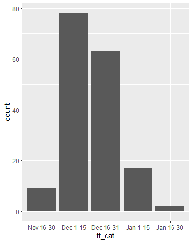

```{r setup, include=FALSE}
knitr::opts_chunk$set(echo = TRUE, message=FALSE, error = TRUE)
library(tidyverse)
```

# Preliminaries

- This file should be in `STAT240/homework/hw02` on your local computer.
- You should also download `lake-monona-winters-2024.csv` and `lake-mendota-winters-2024.csv` to `STAT240/data` on your local computer.

While you should create your answers in the .Rmd file, homework problems are better formatted and therefore easier to read in the .html file. We recommended frequently knitting and switching between the two as you read and solve problems.

```{r read-data, echo = FALSE}
monona = read_csv("../../data/lake-monona-winters-2024.csv") %>% 
  mutate(ff_cat = case_match(
    ff_cat,
    "X" ~ "Jan 1-15",
    .default = ff_cat
  ), 
  ff_cat = reorder(ff_cat, ff_x))
```

# Problem 1

**Create a histogram** of the `duration` of Lake Monona's closures due to ice. (That is, using the `monona` dataframe created above.)

Incorporate the following customizations:

- **Bars should span neat intervals of ten**; [40, 50], [50, 60], and so on. Make sure they start and end on multiples of 10.

- **Change the outline and inside color** of the bars to some custom combination that you think looks good together.

```{r}
# We could've set "boundary" to any multiple of 10
# Alternatively, we could've set "center" to any number ending in 5; like 45 or 85 or 105

ggplot(monona, aes(x=duration)) +
  geom_histogram(boundary = 0, binwidth = 10,
                 color = "navy", fill = "skyblue")
```

# Problem 2

Your friend is trying to produce this plot of frequency counts for the variable `ff_cat`, which captures the date of first freeze in two week periods.



Your friend's attempt below is producing an error.

```{r, error = TRUE}
# Fix your friend's error!
ggplot(monona, aes(x = ff_cat)) +
  geom_col()
```

**Fix** your friend's error by editing the above chunk (or create another one).

Then, below, **explain** why the original code was wrong and why the fixed code works.

```{r}
# Fixed code
ggplot(monona, aes(x = ff_cat)) +
  geom_bar()
```

> geom_col requires two aesthetics, x and y; for when you want to customize the heights of the bars according to some second variable. geom_bar is a shortcut for counting the number of occurrences of a variable and therefore only requires one aesthetic (the other is computed automatically).

# Problem 3

Code in the next chunk makes a scatter plot that shows how the variable `duration` changes with time (using `year1`).

```{r}
# This chunk is provided for you - do not edit
ggplot(monona, aes(x = year1, y = duration)) +
  geom_point(alpha = 0.2) +
  geom_smooth(method = "lm", se=FALSE) +
  labs(
    title = "Lake Monona Winter Closure Durations Over Time",
    subtitle = "Trend Line Shown in Blue"
  )
```

**a)** What does the argument `method = "lm"` change on the plot?

> `method = "lm"` forces the best-fit blue line to be straight. Leaving this argument out allows it to curve as it desires.

**b)** What does the argument `se = FALSE` change on the plot?

> By default, `geom_smooth()` includes a gray ribbon of statistical confidence around it. `se = FALSE` turns this ribbon off.

# Problem 4

This problem refers to the graph created in problem 3 above. Its goal is to display to the viewer that, on average, the duration Lake Monona closes due to ice is decreasing over time.

**a)** In a typical year around 1875, how long would Lake Monona close due to ice? (No code needed - your best guess based on the plot will suffice.) 

> Roughly 115 days; height of blue line at x = 1875.

**b)** In a typical year around 2000, how long would Lake Monona close due to ice?

> Roughly 90 days; height of blue line at x = 2000.

**c)** Consider encountering this graph in a published news paper. Name one specific thing this graph does well to accomplish its goal, and what specific part of the code is responsible for it.

> Example answers: Points are "faded" into background by `alpha = 0.2`, main title and subtitle specified via `labs()`.

**d)** In the same context as c), name one specific thing that could be improved about this graph, and describe what code you would add/edit to make it happen. (No need to formally write and run the code, just a description.)

> Example answers: Axis titles could be improved with `labs()`, tick labeling could be improved by `scale_*_continuous()`, theme could be changed by `theme_bw()` or `theme_minimal()`, etc.

# Problem 5

The below chunk (which is hidden in the knitted file) reads in `lake-mendota-winters-2024.csv` into a new object called `mendota`.

```{r, echo = FALSE, message = FALSE, warning = FALSE}
mendota = read_csv("../../data/lake-mendota-winters-2024.csv")
```

**Create** a single plot of `duration` versus `year1` (as in problem 3) which has **two smooth curved lines**; a red line for Lake Mendota and a blue line for Lake Monona.

You should accomplish this with one call to `ggplot()` and then two calls to `geom_smooth()`, with one using `monona` and one using `mendota`.

```{r}
ggplot(mapping = aes(year1, duration)) +
  geom_smooth(data = mendota, color = "red") +
  geom_smooth(data = monona, color = "blue")
```

# Problem 6

The below chunk creates a new dataframe called `combined`, which contains freeze durations for both Lake Mendota AND Lake Monona.

```{r}
# We will learn how this code works next week!
combined = bind_rows(monona %>% mutate(lake = "Monona"), mendota %>% mutate(lake = "Mendota")) %>% 
  arrange(desc(year1)) %>% 
  select(lake, year1, duration)

# Take a look at the first six rows; notice we have TWO rows for each year now, one for each lake!
head(combined)
```

**Create** a similar plot to the result of problem 5, with `duration` on the y axis, `year1` on the x axis, and two smooth lines, one for each lake. This time, use the `combined` dataset and a single call to `geom_smooth`.

*Hint: You want to `color` the lines by `lake`!*

```{r}
ggplot(combined, aes(year1, duration)) +
  geom_smooth(aes(color = lake))
```

# Problem 7

**Create** a plot which uses **faceting** to separate the trendline of `duration` vs. `year1` (like the previous two questions) into two different panels; one panel for Lake Mendota, one panel for Lake Monona.

```{r}
ggplot(combined, aes(year1, duration)) +
  geom_smooth() +
  facet_wrap(vars(lake))
```

# Problem 8

Compare the resulting graphs from problems 5, 6, and 7.

Consider trying to determine in what time period Lake Mendota was freezing, on average, longer than Lake Monona.

**Which of the three graphs** do you prefer for this determination and why?

> The graph from problem 6 has a distinct advantage over the other two. Problem 5's graph does not have a legend, so viewer would need to read text to determine which is which. Problem 7's graph does not plot them on the same panel, which makes it harder to determine when the lines cross.

