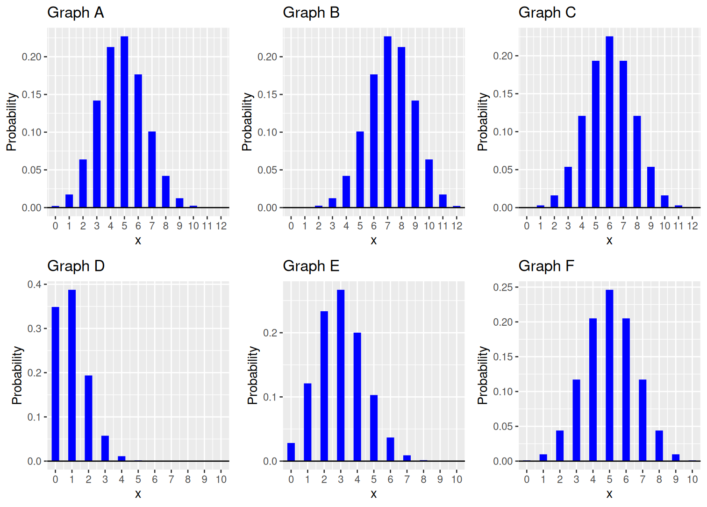

```{r setup, include=FALSE}
knitr::opts_chunk$set(echo = TRUE, message = FALSE,
                      warning = FALSE, error = TRUE,
                      fig.height = 3)
library(tidyverse)
source("../../scripts/ggprob.R")
```

# Preliminaries

- This file should be in `STAT240/homework/hw06` on your local computer.

# Problem 1

For each of the following questions, say whether the random variable is reasonably approximated by a binomial random variable or not, and explain your answer. If the variable is binomial, identify $n$ the number of trials and $p$ the probability of success.  If it is not binomial, identify which of the "BINS" assumptions is violated.

(a) A fair die is rolled until a 1 appears, and $X$ denotes the number of rolls.

> Replace this text with your response.

(b) Twenty of the different Badger basketball players each attempt 1 free throw and $X$ is the total number of successful attempts.

> Replace this text with your response.

(c) A die is rolled 50 times. Let $X$ be the face that lands up most often.

> Replace this text with your response.

(d) In a bag of 10 batteries, I know 2 are old. Let $X$ be the number of old batteries I choose when taking a sample of 4 to put into my calculator.

> Replace this text with your response.

(e) It is reported that 20% of Madison homeowners have installed a home security system. Let $X$ be the number of homes without home security systems installed in a random sample of 100 houses in the Madison city limits.

> Replace this text with your response.


# Problem 2

Create a data frame with the following columns.
Each row corresponds to a single $\text{Binom}(n, p)$ distribution. The first two columns are the parameters of the distribution.

- `n`, which is always equal to 100
- `p`, which ranges from 0 to 1 by 0.01 $(0, 0.01, 0.02, \ldots , 0.99, 1)$
- `mu`, the mean
- `sigma`, the standard deviation
- `q90`, the 0.9 quantile (or 90th percentile)

```{r}
# Write your code here!
```

Create two separate line plots of the following:
- `sigma` versus `p` (y and x axes, respectively)
- `q90` versus `p`


```{r}
# Write your code here!
```

```{r}
# Write your code here!
```

How does the standard deviation change with $p$?

> Replace this text with your response.

Comment on the relationship between the 90th percentile and $p$.

> Replace this text with your response.


# Problem 3

The random variable $X$ has the $\text{Binom}(100, 0.2)$ distribution.
  
- Find an integer $a$ so that $P(X \le a) \ge 0.5$ and $P(X \ge a) \ge 0.5$.
- Show the values of $a$, $P(X \le a)$, and $P(X \ge a)$.

```{r}
# Write your code here!
```


# Problem 4

A student decided to guess randomly on their True/False quiz.  The number of questions they answer correctly is $\text{Binom}(10, 0.5)$.  Write code with `dbinom`, `pbinom`, or `qbinom` to calculate that value or probability.

- "I know I must have gotten at least one question right!"

```{r}
# Write your code here!
```

- "I probably got 3 - 5 of the questions right."

```{r}
# Write your code here!
```

- "I feel lucky.  The answers I picked are better than 90% of my other attempts!" (How many questions did they get right on this quiz attempt?)

```{r}
# Write your code here!
```

Explain why the 90th percentile is not 9. 

> Replace this text with your response.


# Problem 5

Match the four binomial distributions given below to the appropriate graph in `p5_choices.png`. Two of the distributions will not be used. Briefly justify your choices.

- Binom(12, 0.5)

> Replace this text with your response.

- Binom(12, 0.6)

> Replace this text with your response.

- Binom(10, 0.1)

> Replace this text with your response.

- Binom(10, 0.3)

> Replace this text with your response.




# Problem 6

Are the following statements true for Binomial distributions, Normal distributions, or both?

- This distribution is always symmetric.

> Replace this text with your response.

- If you know the two parameters of this distribution, you can calculate its mean, any probability, or any quantile.

> Replace this text with your response.

- If $\mu$ is the mean of the distribution, then the probability distribution graphically reaches its maximum at $\mu$.

> Replace this text with your response.

- If $\mu$ is the mean of the distribution, then it is possible for the probability of getting exactly $\mu$ on a random draw to be 0.

> Replace this text with your response.

# Problem 7

Use `pnorm` to find the probabilities highlighted below on a N(0, 1) curve.

```{r, echo = F}
gnorm(0, 1) +
  geom_norm_fill(0, 1, b = -1, fill = "dodgerblue") +
  geom_vline(xintercept = -1) +
  annotate("text", x = -1.5, y = .35, label = "x = -1")
```

```{r}
# Write your code here!
```

```{r, echo = F}
gnorm(0, 1) +
  geom_norm_fill(0, 1, a = 1, fill = "dodgerblue") +
  geom_vline(xintercept = 1) +
  annotate("text", x = 1.5, y = .35, label = "x = 1")
```

```{r}
# Write your code here!
```

```{r, echo = F}
gnorm(0, 1) +
  geom_norm_fill(0, 1, a = 0.5, b = 2, fill = "dodgerblue") +
  geom_vline(xintercept = 0.5) +
  geom_vline(xintercept = 2) +
  annotate("text", x = 1.1, y = .35, label = "x = 0.5") +
  annotate("text", x = 2.5, y = .35, label = "x = 2")
```

```{r}
# Write your code here!
```

```{r, echo = F}
gnorm(0, 1) +
  geom_norm_fill(0, 1, b = -0.75, fill = "dodgerblue") +
    geom_norm_fill(0, 1, a = 0.75, fill = "dodgerblue") +
  geom_vline(xintercept = -0.75) +
  geom_vline(xintercept = 0.75) +
  annotate("text", x = -1.5, y = .35, label = "x = -0.75") +
  annotate("text", x = 1.5, y = .35, label = "x = 0.75")
```

```{r}
# Write your code here!
```


# Problem 8

Let $X_1$ and $X_2$ be two draws from $X ~ N(10, 4)$. Order the five events below based on which events are least to most likely to occur.

- Event A: $X_1$ > 15
- Event B: $X_1$ = 15
- Event C: $X_1$ < 15
- Event D: $X_1$ > 15 AND $X_2$ > 15
- Event E: $X_1$ > $X_2$

> Replace this text with your response.

