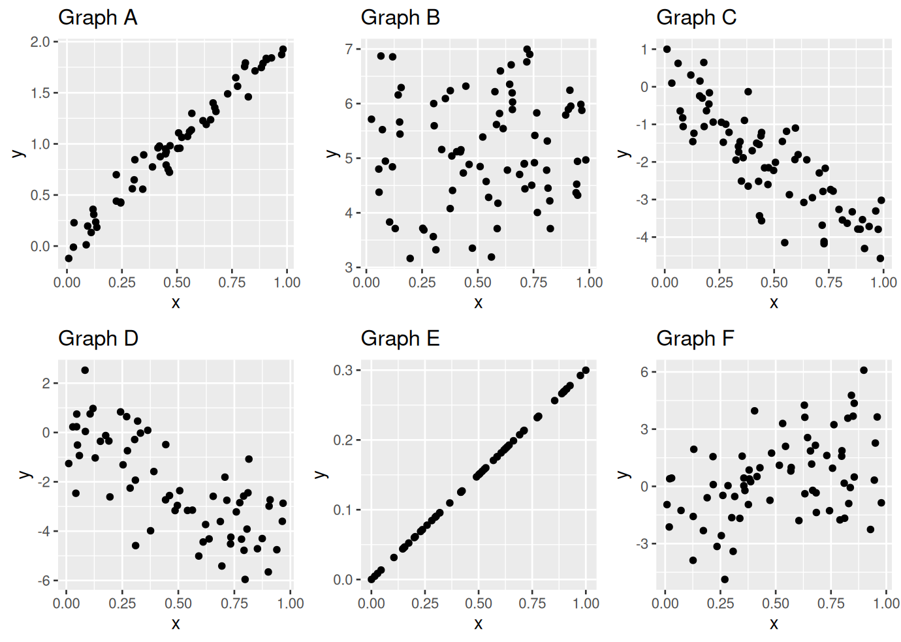

```{r setup, include=FALSE}
knitr::opts_chunk$set(echo = TRUE, message = FALSE,
                      warning = FALSE, error = TRUE,
                      fig.height = 3)
library(tidyverse)
```

# Preliminaries

- This file should be in `STAT240/homework/hw08` on your local computer.
- Download `happiness_2019.csv` to `STAT240/data`.

# Problem 1

You wish to show that your roommate is not home. You check the main areas of your apartment (skipping things like closets or storage rooms) and do not find them.

**(a)** Thinking of this as an inference problem, what are the appropriate null and alternative hypotheses?

> Replace this text with your response.

**(b)** Thinking of this as an inference problem, which of the following is the appropriate conclusion?

A) The probability that we do not find them in the main areas, given that they are NOT home, is 100%. This is not a low p-value, so we fail to disprove that our roommate is home.

B) If they are not home, there is a 100% chance we do not find them. We did not find them, so they are not home.

C) The probability that we do not find them in the main areas, given that they ARE home, is very low. Since we did not find them, that means they are probably not home.

D) If they ARE home, the probability of finding them in the main areas is high. This is not a low p-value, so we fail to disprove that our roommate is home.

> Replace this text with your response.


# Problem 2

We wish to test whether the average person is shorter than the average NBA player. We have data for the whole population of NBA players and know their average height to be 6'6" (78 inches). Let the average height of a non-player be $\mu$.

**(a)** What are the null and alternative hypotheses for this test?

> Replace this text with your response.

**(b)** The Central Limit Theorem says the sample mean of n individuals is approximated by  $N\Big(\mu, \; \frac{\sigma}{\sqrt{n}}\Big)$, where $\mu$ and $\sigma$ are the expectation and standard deviation of the population. Assume $\sigma$, the standard deviation of all non-player heights, is 4 inches. If the null hypothesis was true, what is the distribution of the sample mean of the heights of 5 non-players? 

> Replace this text with your response.

# Problem 3

We wish to test whether the average person is shorter than the average NBA player. We have data for the whole population of NBA players and know their average height to be 6'6" (78 inches). Let the average height of a non-player be $\mu$.

**(a)** We sample 5 non-players and get the heights (70, 61, 63, 65, 72). What is the sample mean? What is the probability of getting a sample mean smaller than this on the distribution from problem 2?

```{r}
heights = c(70, 61, 63, 65, 72)
# Write your code here!
```


**(b)** What do we conclude about the average height of non-players compared to the average height of an NBA player? Are we completely 100% certain of that conclusion?

> Replace this text with your response.

# EXAM 2 CONTENT STOPS HERE. Any content below will not be on exam 2.

# Problem 4

Match the six values of correlation to the scatterplots in `p4_choices.png`. Briefly justify your choices.

- $r = -0.85$

> Replace this text with your response.

- $r = -0.74$

> Replace this text with your response.

- $r = 0.08$

> Replace this text with your response.

- $r = 0.44$

> Replace this text with your response.

- $r = 0.98$

> Replace this text with your response.

- $r = 1$

> Replace this text with your response.



# Problem 5

The [Happiness index](https://www.kaggle.com/datasets/sougatapramanick/happiness-index-2018-2019) data contains information on the happiness index of different countries from 2018-2019.  We will focus on the happiness index (`Score`) and GDP per capita of countries in 2019.

```{r}
happiness <- read_csv("../../data/happiness_2019.csv")

# Remove spaces from column names
names(happiness) <- make.names(names(happiness))
```

**(a)** Create a scatterplot of GDP per capita (x) versus happiness index (y) and calculate the correlation between length and weight.  Comment on the strength and magnitude of the linear relationship, and whether a linear model seems to be appropriate.

```{r}
# Write your code here!
```

> Replace this text with your response.

**(b)** Calculate the slope and intercept of a least-squares linear regression model for GDP per capita versus happiness index.  Do this "by hand" and check your work with `lm`.  Interpret the coefficients in context.

```{r}
# Write your code here!

```

> Replace this text with your response.

# Problem 6

Perform a residual analysis of the happiness linear model to assess the fit.  Build a scatterplot of residuals and comment on the three assumptions:

- Linearity
- Normality
- Constant variance

```{r}
# Write your code here!
```

> Linearity: Replace this text with your response.

> Normality: Replace this text with your response.

> Constant variance: Replace this text with your response.


# Problem 7

Using your linear model, predict the happiness index for theoretical countries with 0.75, 1.25, and 2 GDP per capita.  Which of these predictions would you consider to be the least reliable, and why?

```{r}
# Write your code here!

```


> Replace this text with your response.


# Problem 8

What are the conclusions we can make about the relationship between GDP per capita and happiness index, based on the linear model?  Does money buy happiness?

> Replace this text with your response.


